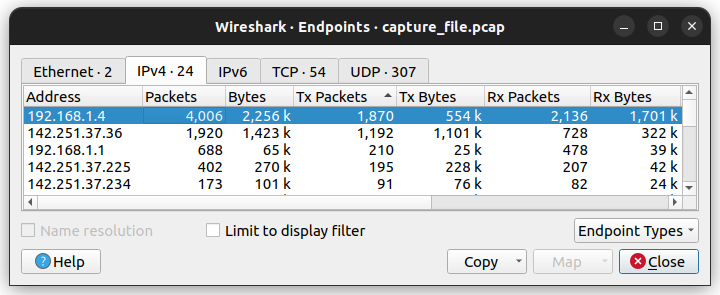

# Kernel Graduation Project
## Network Task Requirements Document

### Code Breakdown
```bash
#!/bin/bash

PCAP_FILE=$1  # Capture input from the terminal.

if [[ -f "$PCAP_FILE" ]]; then # Check if the input is a valid file 

    
else
    echo "Error: '$PCAP_FILE' is not a valid file. Please provide a valid PCAP file path."
    exit 1
fi
```
- Verifies if the provided input is a valid and existing file, If not the script exits with an error.

```bash
   # Extract the file extension and validate it
    file_extension=${PCAP_FILE##*.}
    if [[ "$file_extension" != "pcap" ]]; then
        echo "Error: '$PCAP_FILE' is not a valid PCAP file. Please provide a file with a .pcap extension."
        exit 1
    fi
```
- `file_extension=${PCAP_FILE##*.}` extracts the extension from the file name.
- Compares the extension with "pcap". If it doesn’t match, the script exits with an error.

```bash
# Use tshark or similar commands for packet analysis.
total_packets=$(tshark -r "$PCAP_FILE" -T fields -e frame.number | wc -l)
```
- `tshark -r capture_file.pcap` Reads the capture_file.pcap File.
- `-T fields` Makes tshark Output Only Specific Fields.
- `-e frame.number` Packet Frame Number.
- `wc -l` word count Counts the Number of Lines(Packets) in the Output.

```bash
# Hint: Consider commands to count total packets, filter by protocols (HTTP, HTTPS/TLS).
http_packets=$(tshark -r "$PCAP_FILE" -Y "http" -T fields -e frame.number | wc -l)
https_packets=$(tshark -r "$PCAP_FILE" -Y "tls" -T fields -e frame.number | wc -l)
```
- `-Y "http"` Option in tshark to Apply a Display Filter to Capture Only the Packets that match the `HTTP Request` filter.
- `-Y "tls"` Option in tshark to Apply a Display Filter to Capture Only the Packets that match the `HTTPS/TLS` filter.

```bash
# extract IP addresses, and generate summary statistics.
top_source_ips=$(tshark -r "$PCAP_FILE" -T fields -e ip.src | sort | uniq -c | sort -nr | head -n 5) 
top_dest_ips=$(tshark -r "$PCAP_FILE" -T fields -e ip.dst | sort | uniq -c | sort -nr | head -n 5)
```
- `-e ip.src` and `-e ip.dst` Extract the Source IP Address (ip.src) and Destination IP Address (ip.dst) from each packet in the capture.
- `sort` This Command Sorts the Output IP Addresses from The Previous Step in Ascending Order.
- `uniq -c` The uniq Command Filters out Duplicate Entries, and The -c Option Counts How Many Times each Unique IP Address Entry Appears.
- `sort -nr` Sorts the Output from the Previous Step in numerical (-n) and reverse (-r) order. This means the most frequent source IPs will appear first.
- `head -n 5` It Shows the Five most Frequent IP Addresses Based on the Count of Packets.

### Check End Points in Wireshark 



### Output
```textplain
----- Network Traffic Analysis Report -----
1. Total Packets: 4010
2. Protocols:
   - HTTP: 16 packets
   - HTTPS/TLS: 407 packets

3. Top 5 Source IP Addresses:
   1869 192.168.1.4
   1192 142.251.37.36
    210 192.168.1.1
    195 142.251.37.225
     91 142.251.37.234

4. Top 5 Destination IP Addresses:
   2136 192.168.1.4
    728 142.251.37.36
    477 192.168.1.1
    207 142.251.37.225
     82 142.251.37.234

----- End of Report -----
```
